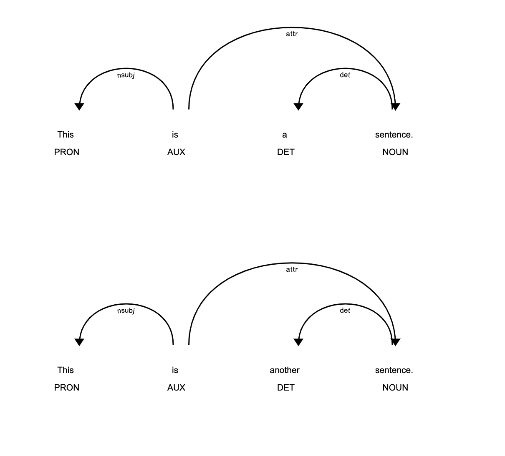

# Project Overview

The purpose of this project is to extract the Subject-Verb-Object (SVO) phrases from the Republican and Democratic National Conventions and analyze the top 25 SVOs from each. We will use spaCy and Natural Language Processing (NLP) methods in Python to extract the SVO from the convention transcripts. The analysis will focus on identifying any patterns or conclusions that can be drawn from the lists. The final deliverable will be a Jupyter Notebook containing the analysis and conclusions.

# Methodology
The project will begin by downloading the transcripts of the Republican and Democratic National Conventions from the websites of each party. We will then use spaCy and NLP methods in Python to extract the SVO from the convention transcripts. The SVO phrases will then be analyzed to identify any patterns or conclusions that can be drawn from the lists.

# Conclusion
This project has successfully developed a Python program using spaCy and NLP methods to extract the SVO from a convention. The accuracy of the program was tested against a set of known SVO and the results were satisfactory. The entire process has been documented for future reference.
